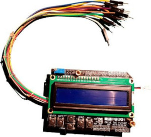
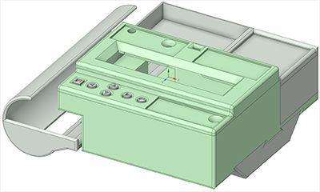
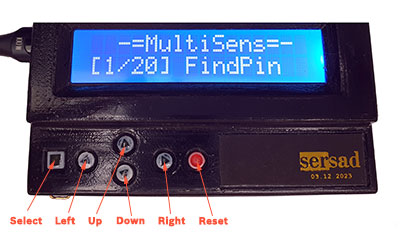

# MultiSens

Arduino Multi Sensor Tester

<p align="center"></p>


## Table of contents
* [Overview](#overview)
* [Supporded devices](#supported-devices)
* [Hardware](#hardware)
* [Software](#software)
* [Adding plugins](#adding-plugins)


## Overview
Sometimes something goes wrong in your project. Maybe you have an error in your schematic.
Maybe there are some bugs in your code. Or your new sensor is damaged. 

This simple tool can helps you to solve one of this problem: **the sensor**.
You can easily connect a sensor to the Multisens, select compartible plugin and check 
if the sensor works properly or not.


## Supported Devices
Currently MuliSens supports following list of devices:

|Plugin|Description|Activated|
|---|---|:---:|
|[FindPin](docs/FindPin.md)|Displays the `msPin` number of selected wire|Yes|
|[I²CScan](docs/I2CScan.md)|Searches for I²C devices|Yes|
|[DigitalAnalog](docs/DigitalAnalog.md)|Reads one digital and one analog pin|Yes|
|[DigitalRead](docs/DigitalRead.md)|Reads digital pins|Yes|
|[AnalogRead](docs/AnalogRead.md)|Reads analog pins|Yes|
|[PWM](docs/PWM.md)|Creates the PWM signal on pins|Yes|
|[DS18B20](docs/DS18B20.md)|Temperature sensor|Yes|
|[AM2320/DHT22](docs/AM2302.md)|Temperature and Humidity sensor|Yes|
|[AHT20](docs/AHT20.md)|Temperature and Humidity sensor|Yes|
|[BME280](docs/BME280.md)|Temperature, Humidity and Pressure sensor|Yes|
|[BMP280+AHT20](docs/BMP280AHT20.md)|Temperature, Humidity and Pressure module|Yes|
|[HTU21D](docs/HTU21D.md)|Temperature and Humidity sensor|Yes|
|[iButton](docs/IButton.md)|DS19xx Serial Number reader|Yes|
|[MH-Z19b](docs/MH-Z19.md)|CO₂ concentration sensor|Yes|
|[QRE1113](docs/QRE1113.md)|Infrared distance sensor|Yes|
|[HC-SR04](docs/HC-SR04.md)|Ultrasonic distance sensor|Yes|
|[RC522](docs/RC522.md)|RFID 13.56 MHz Card reader|Yes|
|[RDM6300](docs/RDM6300.md)|RFID 125 kHz Card reader|Yes|
|[ADXL345](docs/ADXL345.md)|3-axes accelerometer|Yes|
|[MPU6050](docs/MPU6050.md)|3-axes accelerometer and gyroscope|Yes|
|[WS2812](docs/WS2812.md)|WS2812b RGB LED|Yes|
|[Servo](docs/Servo.md)|Servo drive|Yes|
|[Stepper](docs/Stepper.md)|Stepper motor|Yes|
|[TSOP312](docs/TSOP312.md)|TSOP312xx IR receiver|Yes|
|[REncoder](docs/REncoder.md)|Rotary Encoder|No|
|[HX711](docs/HX711.md)|Weighing sensor|No|
|[W5500Lite](docs/W5500Lite.md)|W5500 Lite Ethernet module|No|

Due to the memory limit of the hardware you can not use all plugins simuatinely. 
For example, the [W5500Lite](docs/W5500Lite.md) plugin is deactivated by default. 
See [Plugin activation](#plugin-activation) section to activate/deactivate plugins.

## Hardware
<p align="center"></p>

The hardware is pretty simple. In minimal configuration you need only two modules: `Arduino Uno` 
and `Adruino LCD Keypad Shield`. Just solder 11 wires to Arduino according following table and connect
LCD Keypad Shield. That's all.


|Arduino Pin|MultiSens Pin|Color|Function|
|:---:|:---:|:---|:---|
|GND|GND|Black|Ground|
|5v|+5V|Red|+5V power source|
|3v3|+3.3V|White|+3.3V power source|
|D2|P0|Green|Digital I/O, INT0|
|D3|P1|Blue|Digital I/O, INT1, PWM|
|D11|P2|Yellow|Digital I/O, MOSI, PWM|
|D12|P3|Violet|Digital I/O, MISO|
|D13|P4|Brown|Digital I/O, SCK|
|D17[A3]|P5|Orange|Analog In|
|D18[A4]|P6|Yellow-Black|Analog In, SDA|
|D19[A5]|P7|Gray-Black|Analog In, SCL|


#### The Case
You can print a case with mini breadboard, cables compartment and power bank holder.
А power consumption was too low for my power bank. 
So i decided to add a small flashlight (LED with a resistor and switch) to prevent my power bank 
from automatically turning off in a few seconds.

To use this version of the case you need an Arduino Uno with a `USB Type-C` connector 
(a regular `USB-B` connector doesn't fit this enclosure). And you should unsolder the 
arduino power jack socket.

<p align="center"></p>
Link to the thingverse.

## Software

#### Installation

* Create MultiSens folder in your Arduino sketch directory.
* Open it.
* Clone this repository.
* Run Arduino environment, compile the code and upload it to the board.

**Be careful!** This project was developed and tested for `Arduino Uno` board only!

```bash
mkdir MultiSens
cd MultiSens
git clone https://github.com/sersad-ru/MultiSens
```

#### Required dependencies

This software depens from Arduino standart libraries only. It uses `Software Serial`, `Wire` and
`SPI` libraries. All plugins code uses minimal subset of functions required only for testing sensors.
To take advantage of the full range of sensor capabilities, you'll need full-size libraries from
the Arduino community.

For example, all RFID plugins only reads manufacturer predefined card ID. 
No functions for key manipulation or data writing. 
All plugins for temperature sensors can read current temperature only and 
have no functions to setup sensor resolution and so on.

#### User interface

<p align="center"></p>

The MultiSens has 16x2 LCD display and six buttons:
`SELECT`, `RESET`, `LEFT`, `RIGHT`, `UP` and `DOWN`.

Some button functions depends from plugin logic and some have system-wide functionality.

* The `LEFT` and `RIGTH` buttons are always used to scroll the screen. 
* To scoll the display to the start position, press and hold the `LEFT` button.
* The `RESET` button always terminates the current plugin and reboot the system.
* Holding the `DOWN` button and pressing the `RESET` button will erase **all** plugins 
settings in `EEPROM`.
* In the root menu (after reboot) you can see the system name and a list of registered plugins.
You can select a plugin using the `UP` and `DOWN` buttons. To launch the plugin, press the
`SELECT` button.
* If you hold the `SELECT` button, the current plugin number will be stored in `EEPROM`. 
The plugins list will be scrolled automatically to stored position after reboot. To clear
this setting you can erase all settings by holding the `DOWN` button and pressing the `RESET` button,
or you can just select plugin number one and store it to `EEPROM`.
* The `UP`, `DOWN` and `SELECT` buttons usually used inside plugins to change values and to start
actions.  


#### Plugin activation

Due to the memory limit of the hardware you may need to activate/deactivate some plugins.
To do this, open [MultiSens.ino](/MultiSens.ino) and comment required line in plugin registration
section. After that recompile the code and upload it to the board. 

```c++
// Registered plugins
MultiSensPlugin plugins[] = {

  // Active plugin
  {&plgFindPin,       "FindPin",          0},  
  // Active plugin
  {&plgDigitalAnalog, "DigAn Read",       sizeof(plgDigitalAnalogCfg)}, 

  // Inactive plugin
  // {&plgDigitalRead,   "DigitalRead",      sizeof(plgDigitalReadCfg)},
  // Inactive plugin 
  // {&plgAnalogRead,    "AnalogRead",       sizeof(plgAnalogReadCfg)}, 

...

  {&plgRC522,         "RC522 (13.56MHz)", 0},  // Active plugin   
}; // 

```

**Attention!** Don't forget to clear `EEPROM` settings after changing registered plugin 
list or order of plugins in this list. To do this hold down the `DOWN` button then press the 
`RESET` button.


## Adding plugins
How to write your own plugin.
