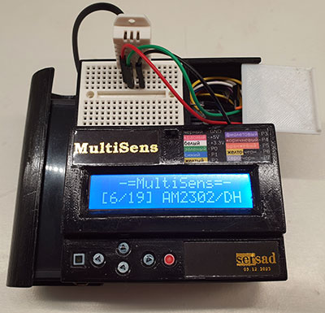

# MultiSens

Arduino Multi Sensor Tester

## Table of contents
* [Overview](#overview)
* [Supporded devices](#supported-devices)
* [Hardware](#hardware)
* [Software](#software)
* [Adding plugins](#adding-plugins)

## Overview
The story of project.

## Supported Devices
Currently MuliSens supports following list of devises:

|Plugin|Description|
|---|---|
|[FindPin](docs/FindPin.md)|Displays the `msPin` number of selected wire|
|[I²CScan](docs/I2CScan.md)|Searches for I²C devices|
|[DigitalAnalog](docs/DigitalAnalog.md)|Reads one digital and one analog pin|
|[DigitalRead](docs/DigitalRead.md)|Reads digital pins|
|[AnalogRead](docs/AnalogRead.md)|Reads analog pins|
|[PWM](docs/PWM.md)|Creates the PWM signal on pins|
|[DS18B20](docs/DS18B20.md)|Temperature sensor|
|[AM2320/DHT22](docs/AM2302.md)|Temperature and Humidity sensor|
|[AHT20](docs/AHT20.md)|Temperature and Humidity sensor|
|[BME280](docs/BME280.md)|Temperature, Humidity and Pressure sensor|
|[BMP280+AHT20](docs/BMP280AHT20.md)|Temperature, Humidity and Pressure module| 
|[HTU21D](docs/HTU21D.md)|Temperature and Humidity sensor|

## Hardware
How to build.

## Software
How to install.

## Adding plugins
How to write your own plugin.