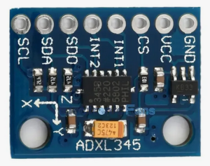
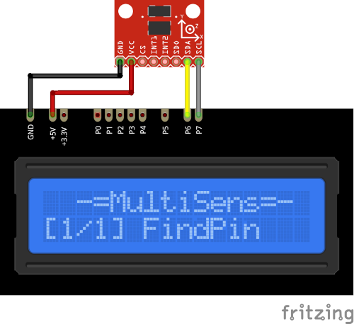

# ADXL345 Plugin

The ADXL345 plugin receives the the acceleration on X, Y and Z axis from the ADXL345 sensor.

Results are displayed on the device screen and sends to the serial in human-readable and 
Arduino `SerialPlotter` compartible format.

* X, Y and Z show the acceleration along x, y, and z axes. Values range from -16 to +16 G.

* Use the `UP` and `DOWN` buttons to display maximum and minimum values. 

* Press `UP`/`DOWN` again to return to normal mode.

* Press the `SELECT` button to enter calibration mode. In this mode place sensor X-axis up and press 
`SELECT`, then repeat it for Y and Z axis.

* Press and hold the `SELECT` button to store calibration offsets in `EEPROM`. 
It will be auto loaded and applied next time. 

* Hold the `DOWN` button and press `RESET` to clear stored value and return to defaults. 
  (**ATTENTION!** All stored data will be cleared. **FOR ALL** plugins!)

* You can specify the delay between sensors calls using `READ_DELAY_MS` 
  in [plgADXL345.cpp](/plgADXL345.cpp)

* ADXL345 I²C address is stored in `ADXL_ADDRESS` in [plgADXL345.cpp](/plgADXL345.cpp)

### Connection

|Sensor Pin|MultiSens Pin|Color|
|:---:|:---:|:---|
|GND|GND|Black|
|VCC|+5V|Red|
|SDA|P6|Yellow-Black|
|SCL|P7|Gray-Black|

[Back to Home](/#supported-devices)

