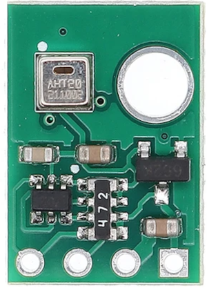
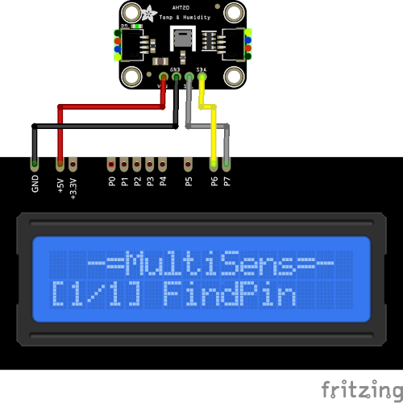

# AHT20 Plugin

AHT20 plugin receive temperature and humidity from I²C module with 
AHT20 sensor.

Results are displayed on the device screen and sends to serial in human-readable and 
Arduino `SerialPlotter` compartible format.

* You can specify the delay between sensors calls using `READ_DELAY_MS` 
  in [plgAHT20.cpp](/plgAHT20.cpp)

* AHT20 I²C address is stored in `AHT_ADDRESS` in [plgAHT20.cpp](/plgAHT20.cpp)

### Connection

|Sensor Pin|MultiSens Pin|Color|
|:---:|:---:|:---|
|GND|GND|Black|
|VIN|+5V|Red|
|SDA|P6|Yellow-Black|
|SCL|P7|Gray-Black|

[Back to Home](/#supported-devices)

