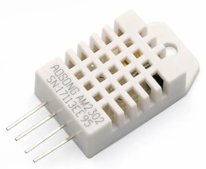
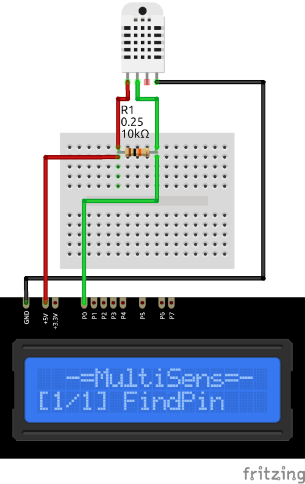

# AM2302/DHT22 Plugin

The AM2302/DHT22 plugin receives temperature and humidity from the AM2302(DHT22) sensor.

Results are displayed on the device screen and sends to the serial in human-readable and 
Arduino `SerialPlotter` compartible format.

* You can specify the delay between sensors calls using `READ_DELAY_MS` 
  in [plgAM2302.cpp](/plgAM2302.cpp)

### Connection

|Sensor Pin|MultiSens Pin|Color|
|:---:|:---:|:---:|
|1.VCC|+5V|Red|
|2.Data|P0 (+ 10kOhm to VCC)|Green|
|3.N/C|N/C|-|
|4.GND|GND|Black|

[Back to Home](/#supported-devices)

