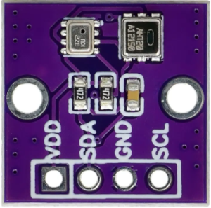
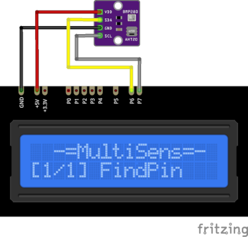

# BMP280 and AHT20 Plugin

BMP280+AHT20 plugin receive temperature, humidity and air pressure from I²C module with 
BMP280 and AHT20 sensors.

Results are displayed on the device screen and sends to serial in human-readable and 
Arduino `SerialPlotter` compartible format.

`BMP280` used for air pressure only and `AHT20` for temperature and humidity.

* You can specify the delay between sensors calls using `READ_DELAY_MS` 
  in [plgBMP280AHT20.cpp](/plgBMP280AHT20.cpp)

* BMP280 I²C address is stored in `BMP_ADDRESS` in [plgBMP280AHT20.cpp](/plgBMP280AHT20.cpp)
* AHT20 I²C address is stored in `AHT_ADDRESS` in [plgBMP280AHT20.cpp](/plgBMP280AHT20.cpp)

### Connection

|Sensor Pin|MultiSens Pin|Color|
|:---:|:---:|:---|
|GND|GND|Black|
|VDD|+5V|Red|
|SDA|P6|Yellow-Black|
|SCL|P7|Gray-Black|

[Back to Home](/#supported-devices)

