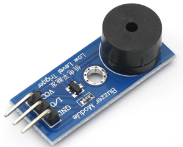
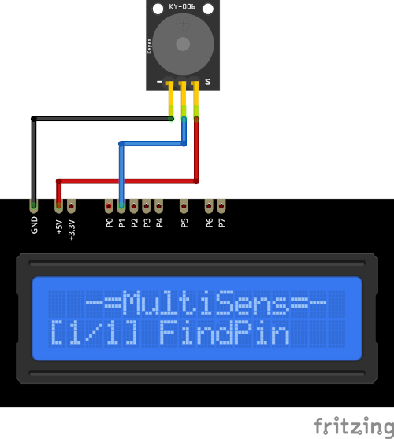

# Buzzer Plugin

The Buzzer plugin generates a tone with the **passive** buzzer. 
Only a passive buzzer can work at various frequency. The range of frequencies are from `31` Hz to `8` MHz.

Current frequency displayed on the device screen and sends to the serial in human-readable format.

* Press the `SELECT` button to start and stop tone generation.

* Use the `UP` and `DOWN` buttons to change the frequency. 

* Press and hold the the `SELECT` button to store current frequency in the the `EEPROM`.

* Hold the `DOWN` button and press `RESET` to clear stored value and return to defaults. 
  (**ATTENTION!** All stored data will be cleared. **FOR ALL** plugins!)

### Connection

|Sensor Pin|MultiSens Pin|Color|
|:---:|:---:|:---|
|GND|GND|Black|
|VCC|+5V|Red|
|IN|P1|Blue|

[Back to Home](/#supported-devices)

