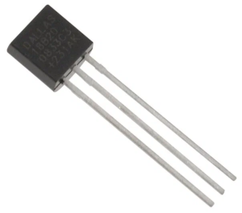
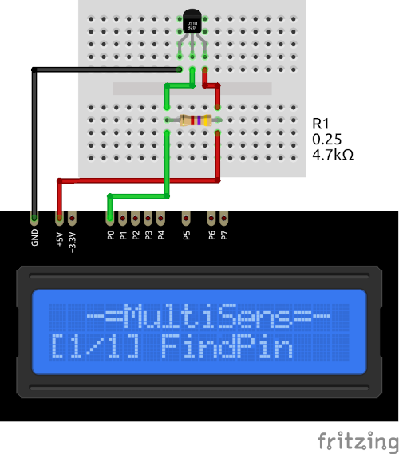

# DS18B20 Plugin

The DS18B20 plugin receives temperature from the 1-Wire DS18B20 sensor.

Results are displayed on the device screen and sends to the serial in human-readable and 
Arduino `SerialPlotter` compartible format.

* You can specify the delay between sensors calls using `READ_DELAY_MS` 
  in [plgDS18B20.cpp](/plgDS18B20.cpp)

### Connection

|Sensor Pin|MultiSens Pin|Color|
|:---:|:---:|:---|
|GND|GND|Black|
|DATA|P0 (+ 4k7Ohm to VCC)|Green|
|VCC|+5V|Red|

[Back to Home](/#supported-devices)

