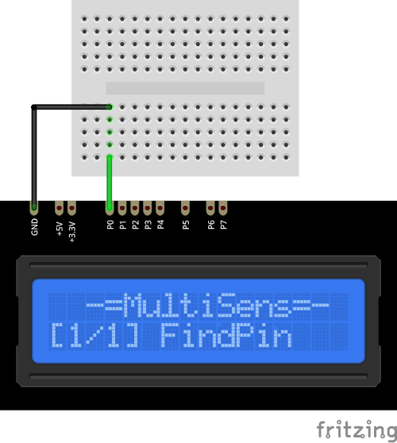

# FindPin Plugin

The FindPin plugin searches for `msPin` number for selected wire. 
You should connect the wire to the ground, then start FindPin plugin to see 
which `msPin` number is atteached to this wire.

### Connection

[Back to Home](/#supported-devices)

