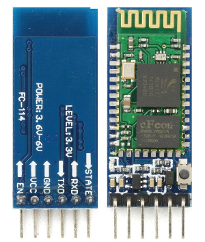
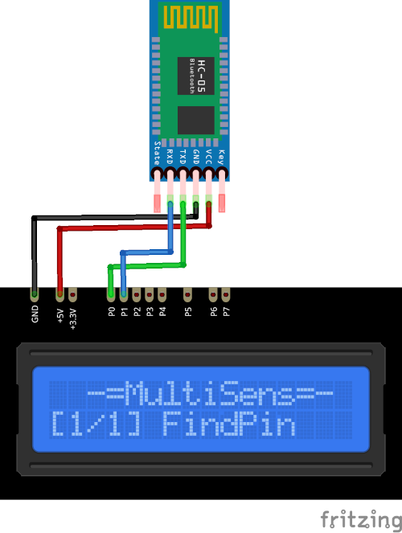

# HC-05/06 Plugin

The HC-05/06 plugin receives information from the HC-05 or HC-06 Bluetooth module.

Results are displayed on the device screen and sends to the `Serial` in human-readable format. 

* Connect the module and run the plugin. 
* The module type will be printed on the screen. 
* **Attention!** If you got "No device found" message with HC-05 module, you should press and hold the `KEY` button on the module before plugin starts. You can unhold the button when module info will be displayed.
* The module LED will blink continuosly. 
* Connect to the bluetooth module using [Bluetooth Terminal](https://f-droid.org/ru/packages/ru.sash0k.bluetooth_terminal/) or similar software. 
* The default PIN is **1234**
* When you enter any text in the terminal, it will be displayed on the device screen, transmitted to the `Serial` and sends back via bluetooth.

### Connection

|Sensor Pin|MultiSens Pin|Color|
|:---:|:---:|:---|
|GND|GND|Black|
|VCC|+5V|Red|
|TXD|P0|Green|
|RXD|P1|Blue|

[Back to Home](/#supported-devices)

