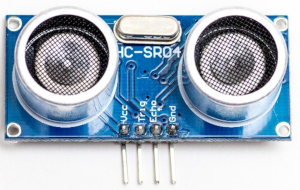

# HC-SR04 Plugin

The HC-SR04 plugin recieves distance information from the HC-SR04 sensor.

Results are displayed on the device screen and sends to the serial in human-readable and 
Arduino `SerialPlotter` compartible format.

* You can specify the delay between sensors calls using `READ_DELAY_MS` 
  in [plgHCSR04.cpp](/plgHCSR04.cpp)

* Use the `UP` and `DOWN` buttons to change current temperature. Available range is -50°C - +50°C. 

* Press and hold the `SELECT` button to store current temperature in the the `EEPROM`.

* Hold the `DOWN` button and press `RESET` to clear stored value and return to defaults. 
  (**ATTENTION!** All stored data will be cleared. **FOR ALL** plugins!)

### Connection

|Sensor Pin|MultiSens Pin|Color|
|:---:|:---:|:---|
|GND|GND|Black|
|VCC|+5V|Red|
|Trig|P0|Green|
|Echo|P1|Blue|

[Back to Home](/#supported-devices)

