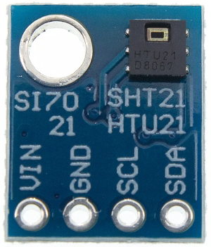
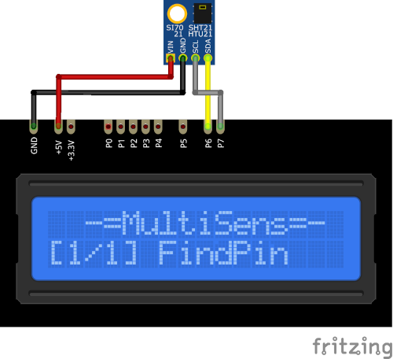

# HTU21D Plugin

HTU21D plugin receives temperature and humidity from the I²C module with 
HTU21D sensor.

Results are displayed on the device screen and sends to serial in human-readable and 
Arduino `SerialPlotter` compartible format.

* You can specify the delay between sensors calls using `READ_DELAY_MS` 
  in [plgHTU21D.cpp](/plgHTU21D.cpp)

* HTU21D I²C address is stored in `HTU_ADDRESS` in [plgHTU21D.cpp](/plgHTU21D.cpp)

### Connection

|Sensor Pin|MultiSens Pin|Color|
|:---:|:---:|:---|
|GND|GND|Black|
|VIN|+5V|Red|
|SDA|P6|Yellow-Black|
|SCL|P7|Gray-Black|

[Back to Home](/#supported-devices)

