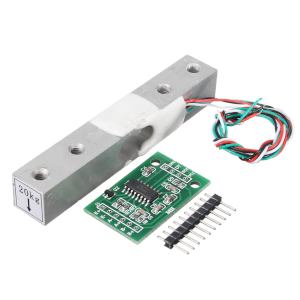
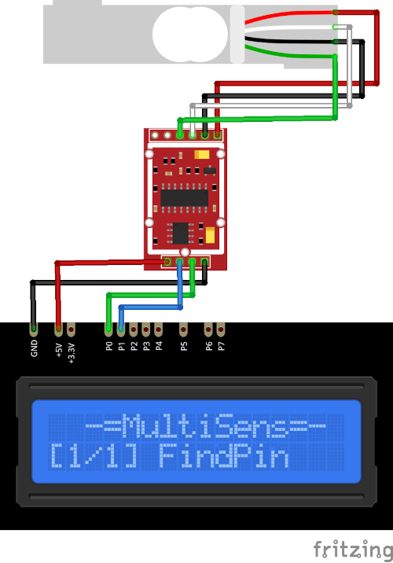

# HX711 Plugin

The HX711 plugin receives information from the HX711 Weighing Sensor and convert it to the 
weight in grams.

Results are displayed on the device screen and sends to the serial in human-readable and 
Arduino `SerialPlotter` compartible format.

* Remove any load from the sensor and press the `SELECT` button to set up zero weight.

* To set up the conversion coefficient: 
  1. place the calibration sample (with known weight) to the sensor. 
  2. Current weight will be displayed. This value may be incorrect.
  3. Press the `UP` and `DOWN` buttons until the displayed value equals the known weight of the 
calibration sample.
  4. Press and hold the `SELECT` button to store the conversion coefficient in the `EEPROM`.

* Hold the `DOWN` button and press `RESET` to clear stored value and return to defaults. 
  (**ATTENTION!** All stored data will be cleared. **FOR ALL** plugins!)

* You can specify the delay between weight measurements calls using `READ_DELAY_MS` 
  in [plgHX711.cpp](/plgHX711.cpp)

### Connection

|Sensor Pin|MultiSens Pin|Color|
|:---:|:---:|:---|
|GND|GND|Black|
|VCC|+5V|Red|
|DT|P0|Green|
|SCK|P1|Blue|

[Back to Home](/#supported-devices)

