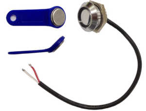
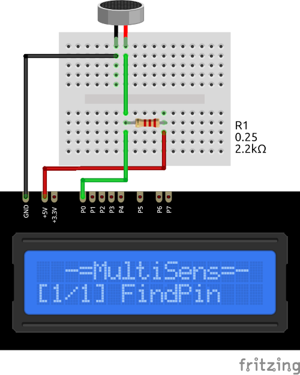

# iButton Plugin

iButton plugin receives serial number from the Dallas DS19xx iButton key.

Results are displayed on the device screen and sends to serial in human-readable format.

### Connection

|Sensor Pin|MultiSens Pin|Color|
|:---:|:---:|:---|
|Ring|GND|Black|
|Center|P0 (+ 2k2Ohm to VCC)|Green|

[Back to Home](/#supported-devices)

