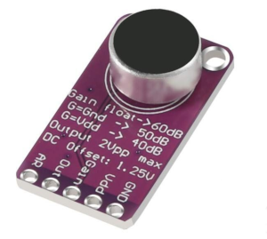
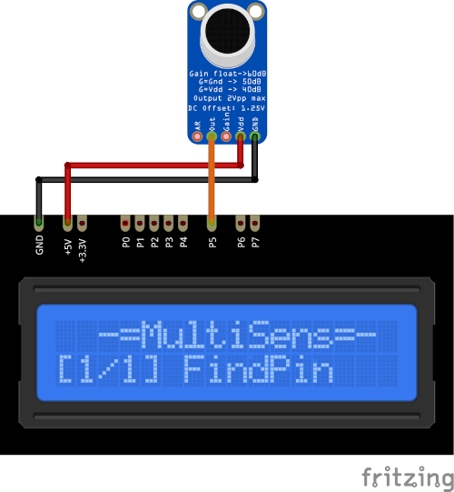

# MAX9814 Plugin

The MAX9814 plugin collects data from the MAX9814 microphone sensor. 
It attempts to detect the harmonic frequency in the signal from 650 to 9500 Hz. 
If successful, it displays the frequency and volume level on the screen.

>*This plugin is based on **Arduino-FrequencyDetector** library by **Armin Joachimsmeyer**
[https://github.com/ArminJo/Arduino-FrequencyDetector](https://github.com/ArminJo/Arduino-FrequencyDetector)*

Results are displayed on the device screen and sends to the serial in human-readable 
and Arduino `SerialPlotter` compartible format.

* You can use online tone generator [https://onlinetonegenerator.com/](https://onlinetonegenerator.com/) 
to create test tone.

* You can specify the delay between display outputs using `DISPLAY_DELAY_MS` 
  in [plgMAX9814.cpp](/plgMAX9814.cpp)

### Connection

|Sensor Pin|MultiSens Pin|Color|
|:---:|:---:|:---|
|GND|GND|Black|
|Vcc|+5V|Red|
|Out|P5|Orange|

[Back to Home](/#supported-devices)

