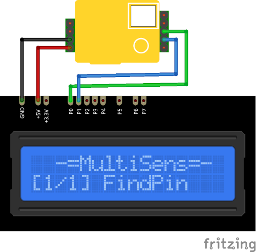

# MH-Z19 Plugin

The MHZ19 plugin recieves CO₂ concentration from the MH-Z19b sensor.

Results are displayed on the device screen and sends to the serial in human-readable and 
Arduino `SerialPlotter` compartible format.

* You can specify the delay between sensors calls using `READ_DELAY_MS` 
  in [plgMHZ19.cpp](/plgMHZ19.cpp)

### Connection

|Sensor Pin|MultiSens Pin|Color|
|:---:|:---:|:---|
|GND|GND|Black|
|VIN|+5V|Red|
|Tx|P0|Green|
|Rx|P1|Blue|

[Back to Home](/#supported-devices)

