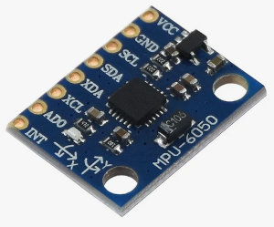
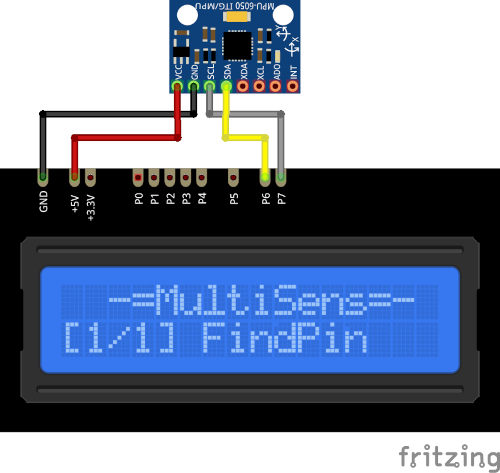

# MPU6050 Plugin

The MPU5060 plugin receives the the acceleration on X, Y and Z axis, the rotation around axes and 
the temperature from the MPU6050 sensor.

Results are displayed on the device screen and sends to the serial in human-readable and 
Arduino `SerialPlotter` compartible format.

* X, Y and Z show the acceleration along x, y, and z axes. Values range from -2 to +2 G.

* A, B and C show the rotation around x, y and z axes. In degrees/s. Values range from -250 to 250.

* T shows the current temperature in °C

* You can specify the delay between sensors calls using `READ_DELAY_MS` 
  in [plgMPU6050.cpp](/plgMPU6050.cpp)

* MPU6050 I²C address is stored in `MPU_ADDRESS` in [plgMPU6050.cpp](/plgMPU6050.cpp)

### Connection

|Sensor Pin|MultiSens Pin|Color|
|:---:|:---:|:---|
|GND|GND|Black|
|VCC|+5V|Red|
|SDA|P6|Yellow-Black|
|SCL|P7|Gray-Black|

[Back to Home](/#supported-devices)

