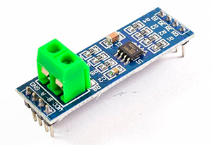
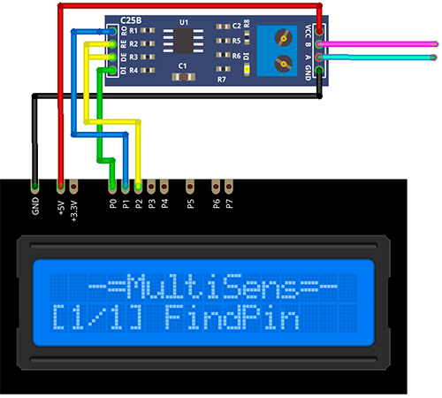

# ModBusScan Plugin

The ModBus Scan plugin searches for the first five ModBus RTU devices on the ModBus bus.

Results are displayed on the device screen and sends to the `Serial` in human-readable format. 

Due to some limitations of `SoftwareSerial` library this plugin can search for devices with 
`8N1` serial port configuration only.

* Connect the module to the MultiSens and to the bus and run the plugin.
* The MultiSens will try to find the module. 
* Current progress (number of founded devices, search percents and estimated time to the end) 
  will be displayed on the screen and send to the Serial.
* You can interrupt the search process any time by pressing the `SELECT` button.
* When the search process will be finished or interrupted the list of founded devices will be displayed. 
  You can scroll it by pressing the `UP` and `DOWN` buttons.
* The maximum number of devices to find is stored in `SCAN_MAX` constant (see [plgModBusSearch.cpp](/plgModBusSearch.cpp)).
* The device reply timeout (in milliseconds) is stored in `TIMEOUT_MS` constant (see [plgModBusSearch.cpp](/plgModBusSearch.cpp)).

### Connection

|Sensor Pin|MultiSens Pin|Color|
|:---:|:---:|:---|
|GND|GND|Black|
|VCC|+5V|Red|
|DI|P0|Green|
|RO|P1|Blue|
|DE|P2|Yellow|
|RE|P2|Yellow|

[Back to Home](/#supported-devices)

