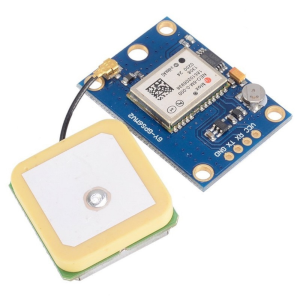
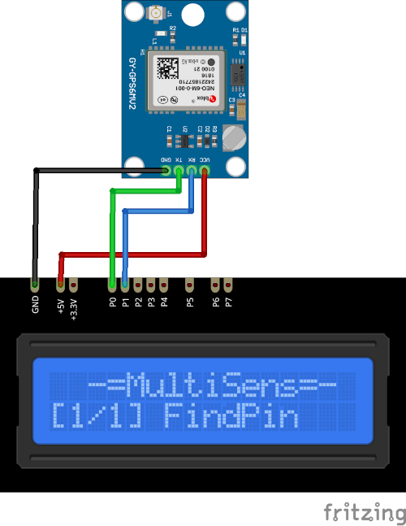

# NEO6MV2 Plugin

The NEO6MV2 plugin receives information from the NEO6MV2 GPS receiver module.

Results are displayed on the device screen and sends to the `Serial` in human-readable format. 

This plugin can parse `GGA`, `RMC`, `GSV` and `ZDA` GPS messages. Information from this messages
are decoded and collected and then displayed in human-readable format. 

* Connect the module and run the plugin.
* The MultiSens will try to find the module. 
* Decoded information will be dispayed every `DISPLAY_DELAY_MS` milliseconds (see [plgNEO6MV2.cpp](/plgNEO6MV2.cpp))
* Press the `UP` and `DOWN` keys to switch information on the screen.
* Press the `SELECT` key to turn on/off sending raw GPS data to the `Serial`.

There are four display modes.
1. The latitude. The first symbol can be `A` (for correct data) or `V`(for incorrect). The second 
symbol is the GPS quality indicator. **0** - fix not available, **1** - GPS fix, **2** - Differential GPS fix.
The next value is the direction `N` for North and `S` for South. Then the current latitude is displayed.

2. The longitude. The first symbol can be `A` (for correct data) or `V`(for incorrect). The second 
symbol is the GPS quality indicator. **0** - fix not available, **1** - GPS fix, **2** - Differential GPS fix.
The next value is the direction `E` for East and `W` for West. Then the current longitude is displayed.

3. The sattelites. The name of the positioning system, the number of the currently active sattelites,
the number of total visible sattelites, `A` (for correct data) or `V`(for incorrect) and the GPS quality indicator.

4. The data and time. The date and time (in UTC) received from the module.

### Connection

|Sensor Pin|MultiSens Pin|Color|
|:---:|:---:|:---|
|GND|GND|Black|
|VCC|+5V|Red|
|TX|P0|Green|
|RX|P1|Blue|

[Back to Home](/#supported-devices)

