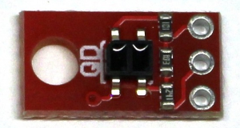
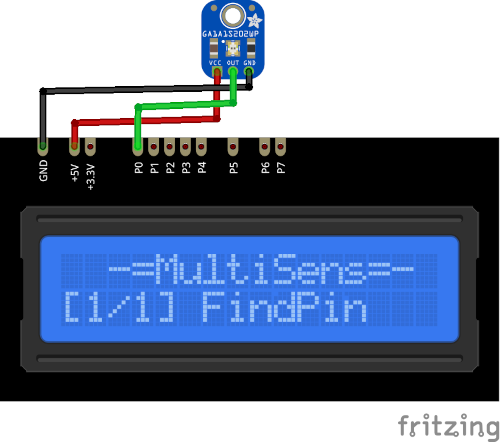

# QRE1113 Plugin

The QRE1113 plugin receives distance from the QRE1113 sensor.

Results are displayed on the device screen and sends to the serial in human-readable and 
Arduino `SerialPlotter` compartible format.

* Use the `UP` and `DOWN` buttons to change poll delay. 
  Avaible values are 10, 50, 100, 250, 500, 1000, 1500 and 2000 ms

* Press and hold the `SELECT` button to store current delay in the `EEPROM`.

* Hold the `DOWN` button and press `RESET` to clear stored value and return to defaults. 
  (**ATTENTION!** All stored data will be cleared. **FOR ALL** plugins!)

### Connection

|Sensor Pin|MultiSens Pin|Color|
|:---:|:---:|:---|
|GND|GND|Black|
|VCC|+5V|Red|
|OUT|P0|Green|

[Back to Home](/#supported-devices)

