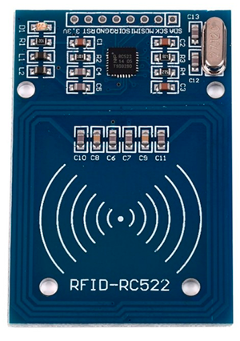
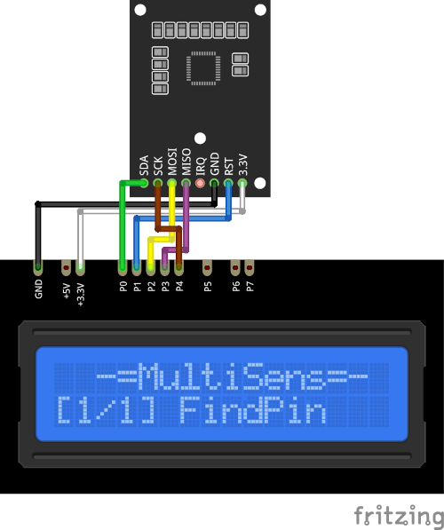

# RC522 Plugin

The RC522 plugin receives 13.56 MHz ISO14443A/MIFARE card ID from the RFID-RC522 module.

Results are displayed on the device screen and sends to serial in human-readable format.

* Place the card on the reader.

* The serial number will remain displayed until the next card will be placed.
 
* You can specify the delay between module scan for a card `READ_DELAY_MS` 
  in [plgRC522.cpp](/plgRC522.cpp)

### Connection

|Sensor Pin|MultiSens Pin|Color|
|:---:|:---:|:---|
|GND|GND|Black|
|3.3V|+3.3V|White|
|SDA|P0|Green|
|RST|P1|Blue|
|MOSI|P2|Yellow|
|MISO|P3|Violet|
|SCK|P4|Brown|

[Back to Home](/#supported-devices)

