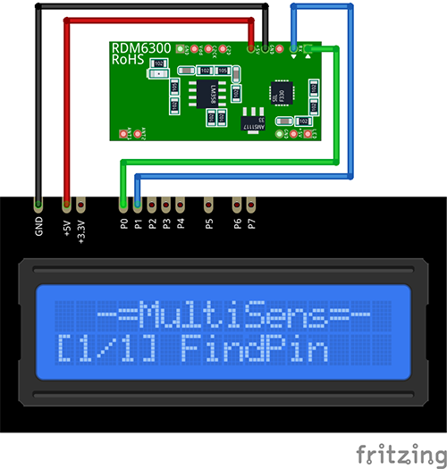

# RDM6300 Plugin

The RDM6300 plugin receives 125 kHz RFID card ID from the RDM6300 module.

Results are displayed on the device screen and sends to serial in human-readable format.

* Place the card on the reader.

* The serial number will be displayed and remains until the next card will be placed.
 
* You can specify the delay between module scan for a card `READ_DELAY_MS` 
  in [plgRDM6300.cpp](/plgRDM6300.cpp)

### Connection

|Sensor Pin|MultiSens Pin|Color|
|:---:|:---:|:---|
|GND|GND|Black|
|+5V|+5V|Red|
|TX|P0|Green|
|RX|P1|Blue|

[Back to Home](/#supported-devices)

