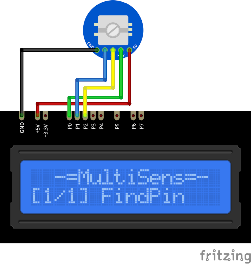

# REncoder Plugin

The REncoder plugin receives signals from the rotary encoder and displays the rotating direction 
and the button status. 

Results are displayed on the device screen and sends to the serial in human readable format. 

* When encoder rotated clockwise (`CW`) it increase the counter. 
* In other direction (`CCW`) the counter decrease. 
* If the button is pressed, the counter will be resetted to zero.

**ATTENTION!**  Don't forget to add pull-up resistors if you are using standalone 
encoder (not the preassembled module). 

### Connection

|Sensor Pin|MultiSens Pin|Color|
|:---:|:---:|:---|
|GND|GND|Black|
|5v|+5V|Red|
|Key|P0|Green|
|S1|P1|Blue|
|S2|P2|Yellow|

[Back to Home](/#supported-devices)

