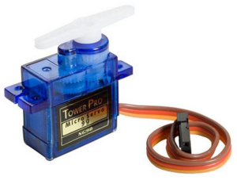
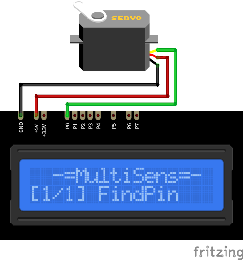

# Servo drive Plugin

The Servo plugin rotates the servo drive to the selected angle (from 0 to 180°).

Results are displayed on the device screen and sends to the serial in human-readable format.

* Use The `UP` and `DOWN` button to change the angle.

* Use the `SELECT` button to start rotation.

* Press and hold the the `SELECT` button to store current angle in the the `EEPROM`.

* **ATTENTION!** To prevent overload of the device, connect only one servo drive without any load.

* Hold the `DOWN` button and press `RESET` to clear stored value and return to defaults. 
  (**ATTENTION!** All stored data will be cleared. **FOR ALL** plugins!)

### Connection

|Sensor Pin|MultiSens Pin|Color|
|:---:|:---:|:---|
|GND|GND|Black|
|VCC|+5V|Red|
|PWM|P0|Green|

[Back to Home](/#supported-devices)

