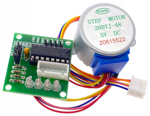
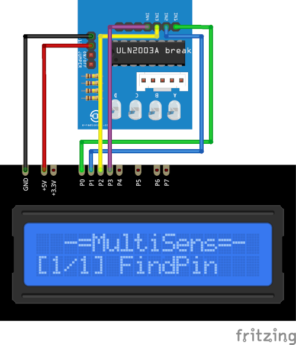

# Stepper motor Plugin

The Stepper plugin drives 28BYj-48 stepper motor with ULN2003 driver.

Results are displayed on the device screen and sends to the serial in human-readable format.

* Use The `UP` and `DOWN` button to change the angle.

* Use the `SELECT` button to start rotation.

* Press and hold the the `SELECT` button to store current delay in the the `EEPROM`.

* Hold the `DOWN` button and press `RESET` to clear stored value and return to defaults. 
  (**ATTENTION!** All stored data will be cleared. **FOR ALL** plugins!)

### Connection

|Sensor Pin|MultiSens Pin|Color|
|:---:|:---:|:---|
|GND|GND|Black|
|VCC|+5V|Red|
|IN1|P0|Green|
|IN2|P1|Blue|
|IN3|P2|Yellow|
|IN4|P3|Violet|

[Back to Home](/#supported-devices)

