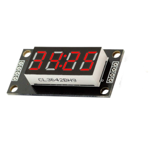

# TM1637 Plugin

The TM1637 plugin sends data to the TM1637 LED controller.

The current position and the symbol code are displayed on the device screen and 
sends to the serial.

* Press the `SELECT` key switch between `auto` and `manual` mode.

* In `auto` mode symbol codes and symbol position are changed automatically.

* In `manual` mode you can press the `UP` and the `DOWN` keys to step back and forward 
in code change sequence.

* You can specify the delay between steps in code change sequence using `STEP_DELAY_MS` 
  in [plgTM1637.cpp](/plgTM1637.cpp)

### Connection

|Sensor Pin|MultiSens Pin|Color|
|:---:|:---:|:---|
|GND|GND|Black|
|VCC|+5V|Red|
|DIO|P0|Green|
|CLK|P1|Blue|

[Back to Home](/#supported-devices)

