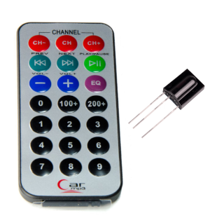
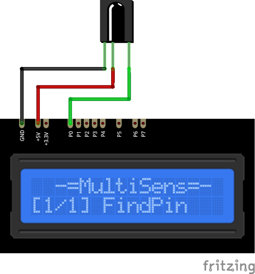

# TSOP312 Plugin

The TSOP312 plugin recieves singnals encoded with NEC protocol from an Infrared Remote Control 
Unit using the TSOP312x receiver.

Results are decoded and displayed on the device screen and sends to the serial in human 
readable format. 

* Press a key on the Remote Control Unit.

* The device address and the command code will be displayed and 
  remains until the next key will be pressed.

### Connection

|Sensor Pin|MultiSens Pin|Color|
|:---:|:---:|:---|
|GND|GND|Black|
|Vs|+5V|Red|
|OUT|P0|Green|

[Back to Home](/#supported-devices)

