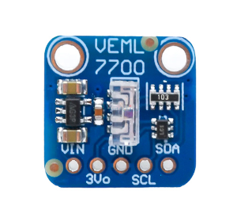
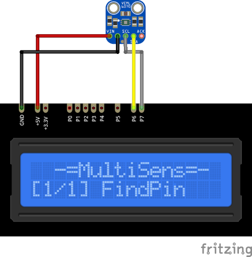

# VEML7700 Plugin

The BH1750 plugin receives ambient light intensity from the I²C module with VEML7700 sensor.

Results are displayed on the device screen and sends to the serial in human-readable and 
Arduino `SerialPlotter` compartible format.

* You can specify the delay between sensors calls using `READ_DELAY_MS` 
  in [plgVEML7700.cpp](/src/plgVEML7700.cpp)

* VEML7700 I²C address is stored in `VEML_ADDRESS` in [plgVEML7700.cpp](/src/plgVEML7700.cpp)

### Connection

|Sensor Pin|MultiSens Pin|Color|
|:---:|:---:|:---|
|VIN|+5V|Red|
|GND|GND|Black|
|SCL|P7|Gray-Black|
|SDA|P6|Yellow-Black|

[Back to Home](/#supported-devices)

