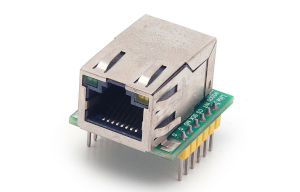
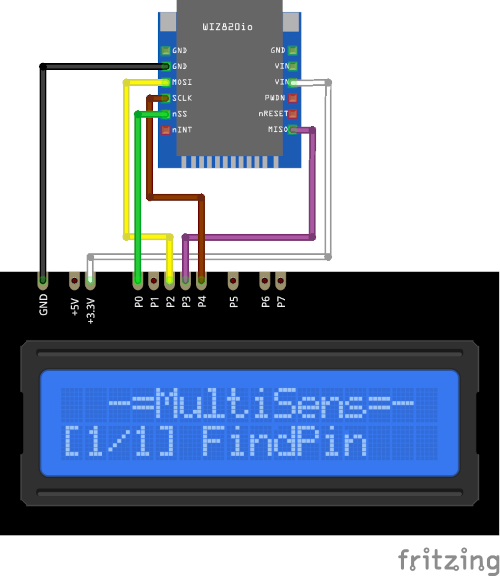

# W5500Lite Plugin

The W5500Lite plugin requests the network settings (IP, Netmask and Gateway) from a DHCP server.

Results are printed on screen and sends to serial in human readable format.

* Use the `UP` and `DOWN` buttons to display IP-adress, Netmask, Gateway and DHCP-server address.

* Use the `SELECT` button to start infinity ping requests to the gateway.
* Use the `SELECT` button to hold ping process end start it again.

### Connection

|Sensor Pin|MultiSens Pin|Color|
|:---:|:---:|:---|
|GND|GND|Black|
|VCC|+3.3V|White|
|CS|P0|Green|
|MOSI|P2|Yellow|
|MISO|P3|Violet|
|SCK|P4|Brown|

[Back to Home](/#supported-devices)

