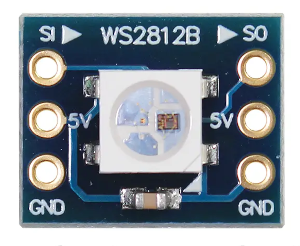
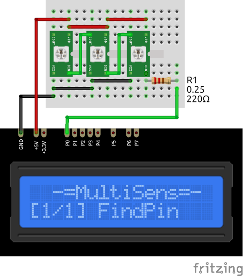

# WS2812 Plugin

The WS2812 plugin can send commands to the WS2812 LEDs. 

* You can specify the number of LEDs using `WS_LED_CNT` in [plgWS2812.h](/plgWS2812.h)

* **ATTENTION!** To prevent the current overload don't use MultiSens on LED Strip. 
Only a few (2-3) leds can be used.

* The display shows the current LED number and R, G and B channel value for the current LED.

* Use the `SELECT` button to select setting to change.

* Use the `UP` and `DOWN` button to change selected setting (LED number or channel value).
 
* Press and hold the `SELECT` button to store RGB values for each LED in the `EEPROM`.

* Hold the `DOWN` button and press `RESET` to clear stored value and return to defaults. 
  (**ATTENTION!** All stored data will be cleared. **FOR ALL** plugins!)

### Connection

|Sensor Pin|MultiSens Pin|Color|
|:---:|:---:|:---|
|GND|GND|Black|
|VCC|+5V|Red|
|DI|P0 through 220 Ohm|Green|

[Back to Home](/#supported-devices)

